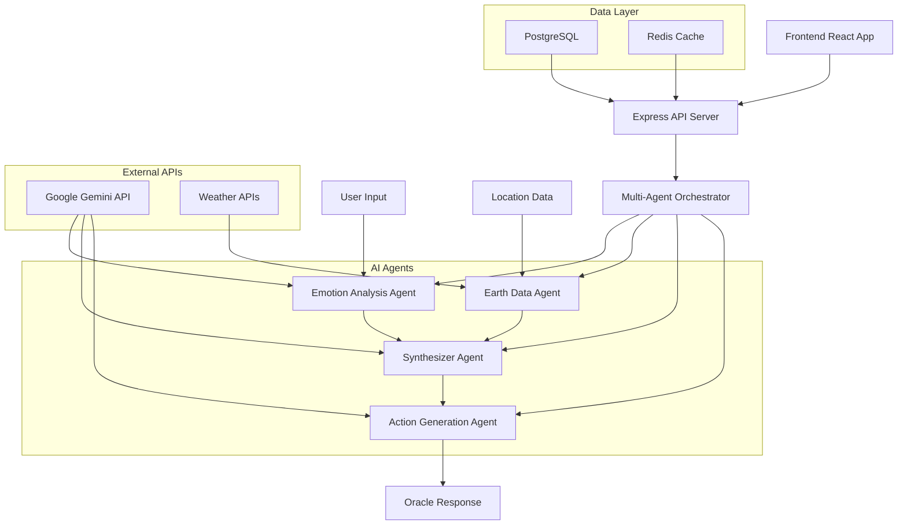

# 🏗️ Sentient Earth Oracle Architecture

## System Overview

The Sentient Earth Oracle is a multi-agent AI system that processes human emotions and environmental data to generate personalized insights and recommendations.

## Architecture Diagram

## Component Details

### Frontend Layer
- **React Application**: User interface with mystical design
- **Real-time Updates**: Emotion-reactive UI themes
- **Export Functionality**: PNG export of oracle readings

### API Layer
- **Express Server**: RESTful API endpoints
- **Authentication**: JWT-based user sessions
- **Validation**: Input sanitization and validation

### AI Agent System
1. **Emotion Analysis Agent**: Processes emotional text using Gemini AI
2. **Earth Data Agent**: Fetches real-time environmental data
3. **Synthesizer Agent**: Creates poetic narratives connecting emotions and environment
4. **Action Generation Agent**: Generates personalized recommendations

### Data Storage
- **PostgreSQL**: User data, oracle responses, session history
- **Redis**: Caching for API responses and session management

### External Integrations
- **Google Gemini**: AI text generation and analysis
- **OpenWeatherMap**: Weather data
- **IQAir**: Air quality information

## Data Flow

1. User submits emotional text through React frontend
2. API validates input and extracts location data
3. Emotion Analysis Agent processes text with Gemini AI
4. Earth Data Agent fetches environmental data in parallel
5. Synthesizer Agent combines both datasets into narrative
6. Action Generation Agent creates personalized recommendations
7. Complete oracle response returned to frontend
8. Response cached and stored for user history

## Security Features

- Input validation and sanitization
- Harmful content detection
- Rate limiting on API endpoints
- Secure environment variable management
- CORS configuration for cross-origin requests

## Scalability Considerations

- Stateless API design for horizontal scaling
- Redis caching to reduce API calls
- Async processing for AI agent coordination
- Database connection pooling
- CDN-ready static asset structure